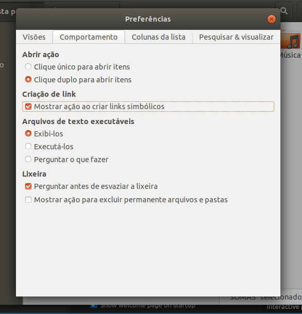

## Tutorial para configuração do notebook do professor.

Este tutorial foi feito para o sistema operacional Ubuntu 18.04, e a máquina precisa se chamar "professor". (Caso a máquina tenha outro nome, será necessário trocar todas as ocorrências da palavra "professor" no script de instalação do notebook do professor, no script de instalação da Raspberry Pi/Labrador do aluno e nas configurações dos atalhos criados para o W3Schools e o VSCode).
Para que tudo seja configurado corretamente, é importante que a máquina do professor seja configurada primeiro e a Raspberry Pi/Labrador seja configurado depois. É importante também que ambas as máquinas estejam conectadas na mesma rede Wi-fi.

### Fixando IP
Primeiramente, é necessário fixar o IP do notebook do professor, para que seu IP seja sempre conhecido previamente e isso facilite a conexão das Raspberry Pi's/Labradores com o notebook do professor.

Para isso, rode o comando a seguir para identificar o IP atual.

```console
ip a
```

Na linha destacada da imagem a seguir está o IP atual do notebook.


Em seguida, vá nas configurações do Ubuntu e na aba Rede, clique no botão destacado, como mostra a imagem a seguir.


Na aba IPv4 selecione o método "Manual". No campo "Máscara de Rede" adicione o valor "255.255.255.255", no campo "Endereço" adicione o endereço de IP atual do notebook, e no campo "Gateway" adicione o mesmo endereço de IP porém com o número "1" substituindo o último valor, como mostra a imagem a seguir.


### Alterando a permissão e executando o script de instalação.

Após copiar ou baixar o script de instalação no notebook do professor,
abra o script em algum editor de texto de sua preferência e troque os valores das constantes "CLASSES" (valor recomendado: 17000) e "IMAGES" (valor recomendado: 20). Estas constantes estão na 4ª e 5ª linhas do script, respectivamente.
Em seguida, navegue com o seu terminal até o diretório onde o arquivo se encontra e execute o comando a seguir:

```console
chmod u+x script_professor
```

Pronto, agora o script do professor tem permissão para ser executado, e para executá-lo, rode o comando a seguir no mesmo terminal.

```console
./script_professor
```

Caso seja solicitado, insira a senha do root do notebook.

Aguarde o término do script, e quando isto acontecer todos os softwares já estarão instalados.

Em seguida, execute o comando a seguir no terminal:

```console
sudo nano ~/.config/code-server/config.yaml
```

E edite o arquivo para ficar como a imagem a seguir, salvando em seguida.


### Criando atalhos

Para criar atalhos personalizados na Área de Trabalho, primeiramente abra o explorador de arquivos, clique em "Arquivos" para abrir o menu drop-down e clique em "Preferências", como mostra a imagem a seguir.


Em seguida, na aba "Comportamento" marque a opção "Mostrar ação ao criar links simbólicos", como mostra a imagem a seguir.



Navegue com o explorador de arquivos até onde está a pasta "SOMAS", que foi criada pelo script de instalação, provavelmente na pasta pessoal do usuário. Clique nela com o botão esquerdo do mouse e então clique em "Criar link". Um atalho será criado, selecione ele e mova-o para a Área de Trabalho.

Para criar o atalho do W3Schools, copie o arquivo W3schools.desktop deste repositório GIT para sua Área de Trabalho.

E para criar o atalho do VSCode, primeiramente execute o comando a seguir no terminal:

```console
code-server --auth none
```

Abra o navegador web Google Chrome e vá para o endereço "0.0.0.0:8080", clique no botão com três pontos no navegador, clique em "Mais ferramentas" no menu drop-down que abrir e em seguida clique em criar atalho, como mostra a imagem a seguir.


Clique em criar na janela de confirmação que aparecer, e um arquivo novo irá aparecer na sua área de trabalho. 
Edite este arquivo com o editor de texto da sua preferência, alterando-o para que as categorias "Encoding", "Name", "Comment", "Icon" e "Name[pt_BR]" fiquem iguais as do arquivo VSCode.desktop deste repositório GIT. As outras categorias devem permanecer inalteradas.

Teste cada um dos atalhos para verificar se eles funcionarão como o esperado (O atalho do VSCode apenas funcionará caso o code-server estiver sendo executado no terminal).

A área de trabalho do notebook do professor deverá se parecer com a imagem a seguir.


### Utilizando o VSCode

Para utilizar o Code Server na máquina do professor, é necessário executar o comando do code-server no terminal e abrir o atalho do VSCode criado na Área de Trabalho. Para possibilitar que os alunos utilizem o VSCode nas máquinas deles, é necessário que o comando do Code Server esteja rodando no terminal da máquina do professor, apenas desta forma os alunos poderão se conectar.

O comando que precisa ser executado na máquina do professor para possibilitar a utilização do code-server na própria máquina ou no kit-aluno é o comando a seguir.

```console
code-server ~/SOMAS/ --auth none
```

Desta forma, o code-server poderá ser utilizado com os arquivos presentes na pasta "SOMAS" em todos os dispositivos conectados na rede, e não será solicitada uma senha aos usuários para permitir a utilização.
